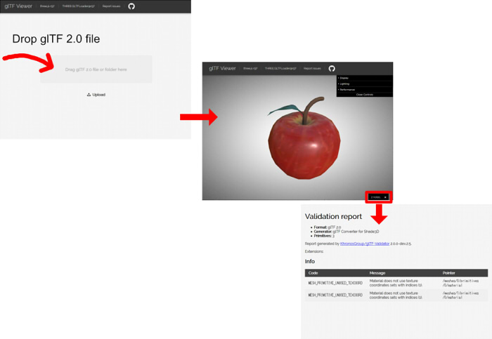

glTFに関する覚書きです。

## glTFを、DCCツールのシーンフォーマットの代わりとして使える ?

DCCツール間で相互変換して再編集する、という目的では厳しいです。    
glTFはコンパクトな設計になっており、無駄はとことん省いています。    
また、どちらかというとリアルタイム向けの最適化前提になっていますので（多角形の保持に対応していない、面ごとに個々に法線/UVを持つ形式ではない、など）    
最終的な出力フォーマットとして扱うのがよいと思われます。

## glTFファイルにシーン構造を持てる ?

ノード(node)の階層構造をglTFに持たせることができます。    
ノードはノード名、メッシュ/カメラのIDと変換行列（移動/回転/スケール要素）のみを持ち、    
ボーン(スケルトン)を使ったノードについては、スケルトンのルートノードを指定、というオプションを持ちます。    

## glTFファイルで、形状名やマテリアル名に日本語を使える ?

UTF-8で指定すれば、WebGLのエンジンでglTFファイルを読み込んでも問題なしでした。    

## glTFファイルで、形状名やマテリアル名で同じものがあっても問題なし ?

内部的にはインデックス(番号)で形状やマテリアルは管理されるため、特に問題はないようです。

## glTFを使ったプロジェクトを作る場合、どれを参考にするのがよい ?

Khronos GroupのglTF 2.0の仕様がすべてになります。    
この仕様を頭に叩き込むのが第一になりそうです。    

https://github.com/KhronosGroup/glTF/blob/master/specification/2.0/

この仕様に合うように各種ビュワーやインポータ/エクスポータを実装していくことになります。    

いくつか動作検証した手ごたえでは、     
WebGLエンジンの three.js ( https://threejs.org/ )、Babylon.js ( http://www.babylonjs.com/ )、CesiumJS (https://cesiumjs.org/ )、が仕様に忠実に実装されているように思いますので、    
これらにglTF(glb)ファイルを読み込んでみて検証するのがよいかと思われます。

## サンプルのglTFファイルがほしい

KhronosGroupで提供されているサンプルglTFがあります。     
glTFローダ開発時の検証に有効です。    

https://github.com/KhronosGroup/glTF-Sample-Models

## glTFファイルの構文が合っているかチェックしたい

WebブラウザでglTF Viewer ( https://gltf-viewer.donmccurdy.com/ )を開き、gltfとbin/画像ファイルをドラッグ＆ドロップする、     
またはglbファイルをドラッグ＆ドロップし、右下の黒枠をクリックします。

ここで、エラーが出ないようになるまでglTFファイルを調整します。    
エラーがある場合、大部分は構文ミスになると思います。    
notesが出る場合は、エラーではないですが無駄がある箇所が検出されます(テクスチャを使用していないのにUVが存在する場合など)。    

## glTFの構文エラーを取り除いていく

glTF Viewerでチェックして検出されたエラーを取り除くには、    
仕様 ( https://github.com/KhronosGroup/glTF/blob/master/specification/2.0/ )と照らし合わせて対処していくことになります。    
エラー除去は、glTFエクスポータサイドでの調整になります。    
ごくまれにですが、3D形状のモデリングで意図しないジオメトリを作成したときにエラー/警告で引っ掛かる場合があります。    
きれいな形でのモデリング（面積ゼロの面を作らない、参照しない頂点を除去、重複面を作らない、など）を心がける必要もあります。

