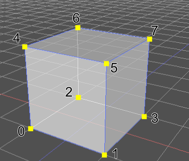
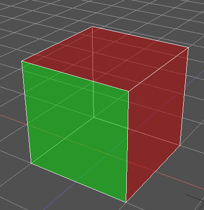
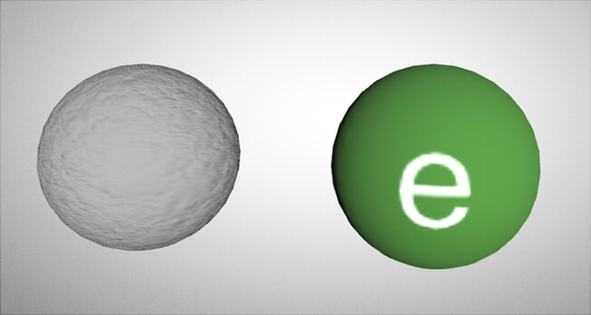
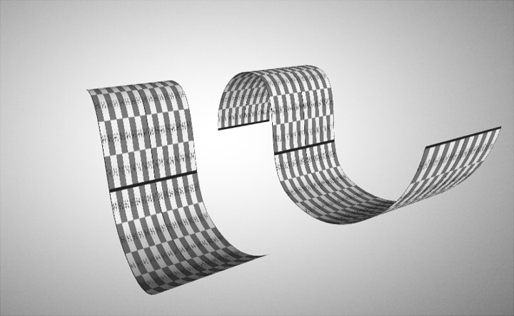

glTFファイルの内部構成についての覚書きです。    

# 参考

以下に、全体の概念図がありますのでここから読み始めるのがよさそうです（日本語の画像もあります）。

https://github.com/KhronosGroup/glTF

glTF 2.0での仕様です (英語)。

https://github.com/KhronosGroup/glTF/blob/master/specification/2.0/README.md

glTF Tutorialsも参考になります (英語)。    

https://github.com/KhronosGroup/glTF-Tutorials/blob/master/gltfTutorial/README.md

# glTFの座標系

右手系Y-upで、単位はメートルになります。    


# glTFの構成

以下、glTFのデータの構成と参照の一覧です。    


構成は、gltf/glbファイルともに同じになります。    
JSON形式の構造で格納されています。    

xxxx.gltfファイルはJSONのテキスト形式が見える状態となっています。    
このとき、メッシュの頂点データやアニメーションデータなどは、バイナリのbinファイルに分離されます（buffersの要素）。     
また、画像はimagesの要素としてuriで指定された外部ファイル(jpeg/png)で参照されます。    

xxxx.glbファイル1つで管理している場合は、展開(Deserialize)するとJSONテキストとなります。     
内容は、xxxx.gltfファイルでのJSONテキストと同じになります。    
画像はimagesからbufferViewのインデックスを指定して参照されます。    
ただし、画像については「画像を外部参照するか、埋め込むか」の指定になるため、     
gltf/glbで差があるかというと、そういうわけではなさそうです。     

以下、各要素の概要です。詳しい説明は省きます。    
仕様の把握は、    
https://github.com/KhronosGroup/glTF/blob/master/specification/2.0/README.md       
を参照するのが一番近道かと思われます。    

## asset

glTFのバージョン(version)指定、glTFを出力したツール(generator)、
著作(copyright)を指定します。     
```
  "asset": {
    "version": "2.0",
    "generator": "glTF Converter for xxxx",
    "copyright": "xxxx"
  },
```

## scenes

シーン情報を指定します。    
複数のシーンを持つことができ、
それぞれでルートとして参照するノードを指定します。

```
  "scenes": [
    {
      "nodes": [
        0
      ]
    }
  ],
  "scene": 0,
```
とした場合は、1つのシーンを持ちルートを0番目のノードとしています。
ルートノードは複数持つことができます。    
また、「"scene": 0」で読み込むシーン番号を指定します。    

## nodes

シーン階層情報を指定します。    
```
  "scenes": [
    {
      "nodes": [
        0
      ]
    }
  ],

  "nodes": [
    {
      "children": [
        1,
        2
      ],
      "name": "root"
    },
    {
      "mesh": 0,
      "name": "ground"
    },
    {
      "children": [
        3,
        4
      ],
      "name": "lodge"
    },
    {
      "mesh": 1,
      "name": "door"
    },
    {
      "mesh": 2,
      "name": "lodgeMesh"
    }
  ],
```
nodes内で順番に0から始まるインデックスが割り当てられており、    
上記の場合はscenesでルートノードを0と指定しているため、    
0番目のルートノードから始まり、以下のような構成になります。
```
  [root]
     ground (mesh 0)
     [lodge]
        door (mesh 1)
        lodgeMesh (mesh 2)
```
root/lodgeは変換行列のみを持つノードになります。    
"mesh"の指定があるものは、meshesで指定された要素のインデックスにより、Mesh情報を持ちます。    

"name"はノード名となり、他の名前と重複してもOK。     
名前で日本語を扱う場合は、JSON自身をUTF-8で保存する必要があります。    

### 変換要素を指定

各ノードでTRS(Translation/Rotation/Scale)を指定できます。    
```
    {
        "mesh": 0,
        "name": "mesh1",
        "translation": [
            -0.2,
            -0.3,
            -0.4
        ],
        "rotation": [
            -0.10319245606660843,
            0.2491285800933838,
            0.3685077428817749,
            -0.8896563053131104
        ],
        "scale": [
            2.0,
            2.0,
            2.0
        ]
    },
```
"translation"が移動量、"rotation"が回転（Quaternion）、"scale"が拡大縮小になります。    
"translation"のデフォルトは(0, 0, 0)、    
"rotation"のデフォルトは(0, 0, 0, 1)、    
"scale"のデフォルトは(1, 1, 1)、    
となり、この場合は省略できます。    

4x4変換行列を指定することもできます。    
```
    {
        "mesh": 0,
        "name": "mesh1",
        "matrix": [
            1.0,
            0.0,
            0.0,
            0.0,
            0.0,
            1.0,
            0.0,
            0.0,
            0.0,
            0.0,
            1.0,
            0.0,
            0.0,
            0.0,
            0.0,
            1.0
        ]
    },
```
上記の場合は、単位行列を指定しています。この場合は省略可能です。    
```
   [m00 m01 m02 m03]
   [m10 m11 m12 m13]
   [m20 m21 m22 m23]
   [m30 m31 m32 m33]
```
の4x4行列があるときに、以下のように格納します。
4x4行列は「T * R * S」で「Translation(移動)」「Rotation(回転)」「Scale(スケール)」を累積したものになります。
```
        "matrix": [
            m00,
            m01,
            m02,
            m03,
            m10,
            m11,
            m12,
            m13,
            m20,
            m21,
            m22,
            m23,
            m30,
            m31,
            m32,
            m33
        ]
```
また、行列指定であっても移動、回転、スケール以外は表現できません（せん断を表現することはできません）。     

### ノードの種類

変換行列(TRS)だけ持つノード、    
meshのインデックスを指定したノード(変換行列を持てる)、    
cameraのインデックスを指定したノード(変換行列を持てる)、の3つのみです。    

Skinのボーン(Skeleton)としてのノードは、skin要素内のskeletonまたはjoints配列で指定することになります。    

## meshes

メッシュ情報を指定します。     
メッシュは、meshの中に単一または複数のprimitiveを指定することで表現します。     
以下は1Mesh内に2Primitiveを指定しています。    
```
    "meshes": [
        {
            "name": "box",
            "primitives": [
                {
                    "attributes": {
                        "POSITION": 1,
                        "NORMAL": 2,
                        "TEXCOORD_0": 3
                    },
                    "indices": 0,
                    "material": 0
                },
                {
                    "attributes": {
                        "POSITION": 5,
                        "NORMAL": 6,
                        "TEXCOORD_0": 7
                    },
                    "indices": 4,
                    "material": 1
                }
            ]
        }
    },
```
MeshをPrimitiveごとに分けることで、
同一Mesh内で面ごとにグループ化した状態にし、異なるマテリアルを持たせるといった実装が可能となります。    

メッシュ名は"name"より"box"となります。     

"attributes"内に頂点情報として位置(POSITION)、法線(NORMAL)、UV0(TEXCOORD_0)を格納しています。    
その他、attributesでは以下を指定できます。    

| 名前 | 役割 | 格納データ (*1) |
|:-----------|:-----------|:-----------|
| POSITION | 位置 | (x, y, z) x 頂点数 |
| NORMAL | 法線 | (x, y, z) x 頂点数 |
| TEXCOORD_0 | UV0 | (u, v) x 頂点数 |
| TEXCOORD_1 | UV1 | (u, v) x 頂点数 |
| COLOR_0 | 頂点カラー | (red ,green, blue, (alpha)) x 頂点数 |
| JOINTS_0 | Skin時の影響ノード番号 | (n0, n1, n2, n3) x 頂点数 |
| WEIGHTS_0 | Skin時のウエイト | (w0, w1, w2, w3) x 頂点数 |

*1 : データの型については、格納するデータにより変更できます。

attributes内の「"POSITION": 1」の数値は、accessorsのインデックスを指します。    

"indices"は三角形の頂点インデックスを指定。「"indices": 0」の数値が、accessorsのインデックスを指します。    

"material"はマテリアルのインデックスを指定。「"material": 0」の数値が、materialsのインデックスを指します。    

### Meshの構成について

Meshは、頂点データ（位置、法線、UV、頂点カラーなど）と三角形の頂点インデックスで表現されます。    

以下のような立方体の場合、一般的なDCCツールでは8つの頂点と6つの四角形で構成されます。    
    
四角形の面は、反時計回りに1-5-4-0としたときに表を向きます。    
同様に、3-7-5-1、2-6-7-3、0-4-6-2、5-7-6-4、0-2-3-1、が四角形の面の頂点インデックスとなります。    
    
この場合、「面の頂点ごとに」頂点位置や法線ベクトル、UVなどが割り当てられます。    

一方、glTFを含むリアルタイム用途では、以下の構成でメッシュの管理を行います。    
* 三角形ごとに頂点インデックスを持つ
* 頂点位置/法線ベクトル/UVなどは、同じ数になり共有させる

頂点と三角形の頂点インデックスが完全に分離した構成になります。    
例えば、上画像の頂点5は面0/面1/面4で共有されていますが、    
頂点を共有させる場合は法線ベクトルが同じである必要があるため、同一位置でありながら3つの頂点に分離することになります。    
立方体のそれぞれの頂点は3つの面を共有する状態のため、8x3=24頂点必要となります。    
法線ベクトルの他、UVや頂点カラーを持つ場合は頂点は増えることになります。    
最大で、三角形数 * 3の頂点を持つことになります。    
    
上画像の場合は、頂点2と頂点7は同じ位置ですが法線ベクトルやUVが異なるため、2つの頂点に分離されています。    

このときの頂点位置(POSITION)、法線ベクトル(NORMAL)、UV0(TEXCOORD_0)は、glTFのmesh内のattributesとして格納します。    
データ自身はaccessors-bufferViews-buffers経由でバイナリで格納されます。    
三角形の頂点インデックスはglTFのmesh内の"indices"として格納します。    
頂点インデックスデータ(整数値、三角形数 x 3)自身はaccessors-bufferViews-buffers経由でバイナリで格納されます。    

### 1Meshで複数Primitiveを持つ構成

以下のように1つのMesh内に複数のPrimitiveを入れている場合、    
1つのPrimitiveに対して
頂点データ("attributes"内)、三角形の頂点インデックス("indices")、マテリアル("material")のインデックスを持ちます。    
```
    "meshes": [
        {
            "name": "box",
            "primitives": [
                {
                    "attributes": {
                        "POSITION": 1,
                        "NORMAL": 2,
                        "TEXCOORD_0": 3
                    },
                    "indices": 0,
                    "material": 0
                },
                {
                    "attributes": {
                        "POSITION": 5,
                        "NORMAL": 6,
                        "TEXCOORD_0": 7
                    },
                    "indices": 4,
                    "material": 1
                }
            ]
        }
    },
```
    
この場合は、個々のPrimitiveの情報は完全に分離されています。    

### 複数Primitiveを持つ場合の頂点共有

以下の場合は、Mesh内のPrimitiveで    
"attributes"内の"POSITION"、"NORMAL"、"TEXCOORD_0"、は2つのPrimitiveで同一のaccessorのインデックスを指しています。    
```
    "meshes": [
        {
            "name": "box",
            "primitives": [
                {
                    "attributes": {
                        "POSITION": 1,
                        "NORMAL": 2,
                        "TEXCOORD_0": 3
                    },
                    "indices": 0,
                    "material": 0
                },
                {
                    "attributes": {
                        "POSITION": 1,
                        "NORMAL": 2,
                        "TEXCOORD_0": 3
                    },
                    "indices": 4,
                    "material": 1
                }
            ]
        }
    },
```
この場合は、複数Primitiveで頂点データが共有された状態といえます。    
頂点データを共有し、個々のPrimitiveでは三角形の頂点インデックス("indices")と"material"は別のものを参照しています。    
こうすることでPrimitiveをまたぐ際の重複頂点の無駄が省かれることになり、    
glTFのファイルサイズを若干小さくすることができます。    

### primitiveのmodeについて

※ 本件は、2018/10現在は未検証。    

デフォルトでは、primitiveでの面の格納は三角形ごとになります。    
三角形ごとの格納は、以下の「"mode": 4」が省略された状態になります。    
```
            "primitives": [
                {
                    "attributes": {
                        "POSITION": 1,
                        "NORMAL": 2,
                        "TEXCOORD_0": 3
                    },
                    "indices": 0,
                    "material": 0,
                    "mode": 4,
                },
```

| mode | 説明 | 
|:-----------|:-----------|
| 0 |POINTS|
| 1 |LINES|
| 2 |LINE_LOOP|
| 3 |LINE_STRIP|
| 4 |TRIANGLES (デフォルト)|
| 5 |TRIANGLE_STRIP|
| 6 |TRIANGLE_FAN|

大部分のglTFファイルは、「"mode": 4」を指定しない場合（TRIANGLESでの指定）が多いようです。    

## accessers/bufferViews/buffersについて

Mesh内のPrimitiveからの頂点データや三角形の頂点インデックスなど、
各種データについてはJSON内ではなくバイナリ形式で別途格納します。    

    

Mesh内のprimitivesで以下のように記述した場合、    
"POSITION"はaccessorsの2番目、    
"NORMAL"はaccessorsの1番目、    
"TEXCOORD_0"はaccessorsの3番目、    
"indices"はaccessorsの0番目を参照します。    
```
    "primitives": [
        {
            "attributes": {
                "POSITION": 2,
                "NORMAL": 1,
                "TEXCOORD_0": 3
            },
            "indices": 0,
            "material": 0
        },
```

参照先のaccessorsでは以下のように記載されています。
```
    "accessors": [
        {
            "bufferView": 0,
            "componentType": 5123,
            "count": 36,
            "type": "SCALAR"
        },
        {
            "bufferView": 1,
            "componentType": 5126,
            "count": 24,
            "type": "VEC3"
        },
        {
            "bufferView": 2,
            "componentType": 5126,
            "count": 24,
            "type": "VEC3",
            "max": [
                0.5,
                0.5,
                0.5
            ],
            "min": [
                -0.5,
                0.0,
                -0.5
            ]
        },
        {
            "bufferView": 3,
            "componentType": 5126,
            "count": 24,
            "type": "VEC2"
        },
```

"bufferView"は、bufferViews内の参照インデックス、    
"componentType"は、格納要素の最小単位のデータの型になります。    

| componentType | 説明 | バイト数 | 範囲 |
|:-----------|:-----------|:-----------|:-----------|
| byte (5120) | 符号付きbyte |1 byte |-128 ～ +127|
| unsigned byte (5121) | 符号なしbyte |1 byte|0 ～ +255|
| short (5122) | 符号付きshort|2 byte |-32768 ～ +32767|
| unsigned short (5123) | 符号なしshort |2 byte|0 ～ +65535|
| unsigned int (5125) | 符号なしint |4 byte|0 ～ +4294967295|
| float (5126) | float |4 byte| |

"count"は、格納要素数になります。    
"type"は、1要素の型になります。   

| type | 要素数 | 説明 | 
|:-----------|:-----------|:-----------|
| "SCALAR" |1| 単一要素。"indices"の格納など |
| "VEC2" |2| Vector2。"TEXCOORD_0"の格納など |
| "VEC3" |3| Vector3。"POSITION" "NORMAL"の格納など |
| "VEC4" |4| Vector4。"COLOR_0" の格納など |
| "MAT2" |4| 2x2行列 |
| "MAT3" |9| 3x3行列 |
| "MAT4" |16| 4x4行列 |

1つの要素でのバイト数は、「componentTypeのバイト数 x typeの要素数」となります。   

### indicesの参照

indicesで、三角形の頂点インデックスのバッファを指定しています。   
accessorsで、データへのアクセス情報（インデックスのようなもの）を記載します。    
accessorsでは以下のように記述されています。    
```
        {
            "bufferView": 0,
            "componentType": 5123,
            "count": 36,
            "type": "SCALAR"
        },
```
「"componentType": 5123」より「unsigned short」、    
「"type": "SCALAR"」より単一要素の格納、    
「"count": 36」より、格納要素数は36となります。    
三角形の頂点インデックスは、合計で「2 x 36 = 72」バイト分のデータとなります。    
三角形1つ分で3要素を消費するため、「36 / 3 = 12」三角形で構成されることになります。    
三角形の頂点インデックスの要素数が65535以下の場合は、"componentType"は「unsigned short」内に収めることができます。    
65535以上の場合は"componentType"は「unsigned int」を指定することになるため、5125を指定します。    
こうすることで、要素数が65535以下の場合は
unsigned short(5123)での格納では頂点インデックスのデータを半分、unsigned byte(5121)での格納では1/4にすることができます。    
（glTFを読み込む場合は、この"componentType"を意識する必要があります）    
「"bufferView": 0」より、bufferViewsの0番目を参照します。
bufferViewsでは以下のように記載されています。    
```
    "bufferViews": [
        {
            "buffer": 0,
            "byteOffset": 0,
            "byteLength": 72,
            "target": 34963
        },
        {
            "buffer": 0,
            "byteOffset": 72,
            "byteLength": 288,
            "target": 34962
        },
```
bufferViewsは、データを格納する際のバッファ内の参照の開始位置（byteOffset）、格納データの長さ（byteLength）、格納の種類を指定します。   
上のコードの場合、0番目のbufferViewでは「"byteOffset": 0」で格納はバッファの先頭から、「"byteLength": 72」で72バイト分格納します。    
accessorsでは「unsigned short」を36個分とした72倍と一致しています。    
注意点として、バッファへの格納は1つのデータは4の倍数(aligned to 4-byte boundaries)で指定する必要があります。    
accessorのcomponentTypeがbyte/shortの場合はそれぞれ1バイト、2バイトになるため、4の倍数に収まらない場合があります。    
このときは、bufferView-bufferでの格納で4の倍数になるように詰め物をします。    

bufferViewsの次のbufferView要素では、同一"buffer"を参照する場合に "byteOffset"は1つ前の"byteOffset" + "byteLength"に一致します。    

"target"は、以下のようになります。    

| target | 説明 | 
|:-----------|:-----------|
| ARRAY_BUFFER (34962) |VEC2/VEC3などの配列 |
| ELEMENT_ARRAY_BUFFER (34963) |単一要素(SCALAR)の配列 |

「"buffer": 0」にてbuffers内のバッファのインデックスを指定します。    

buffersでは以下のように記載されています。    
buffersは最終的なbinの出力先になります。    
```
    "buffers": [
        {
            "byteLength": 13492,
            "uri": "gltf_test_01.bin"
        }
    ],
```
「"byteLength": 13492」でバッファのバイト数を指定します。    
gltfファイルの場合は"uri"でbinファイルの出力先を指定、    
glbファイルの場合は"uri"は指定せず、このbuffers内にデータが埋め込まれます。    

### "POSITION"の参照

primitiveの位置指定は、「"POSITION": 2」でaccessorsの2番目を参照するとします。   
```
    "accessors": [
        {
            ... 省略 ...
        },
        {
            ... 省略 ...
        },
        {
            "bufferView": 2,
            "componentType": 5126,
            "count": 24,
            "type": "VEC3",
            "max": [
                0.5,
                0.5,
                0.5
            ],
            "min": [
                -0.5,
                0.0,
                -0.5
            ]
        },
```
「"componentType": 5126」よりfloat型。    
「"type": "VEC3"」よりVector3型(float x 3 = 12バイト分)。   
「"count": 24」で要素数は24個分。     
「"bufferView": 2」でbufferViewsの2番目を参照。    

その後に、"max" "min"の指定があります。    
頂点座標のprimitiveでのバウンディングボックスを計算して最小を"min"に、最大を"max"に入れます。    
primitiveの頂点座標をaccessorに格納する場合は、この"max" "min"の指定は必須になります。    
それ以外の法線/UV/頂点カラーなどの格納では、この"max" "min"の指定は不要です。    

bufferViewsでは以下のように記載されています。    
```
    "bufferViews": [
        {
            ... 省略 ...
        },
        {
            ... 省略 ...
        },
        {
            "buffer": 0,
            "byteOffset": 360,
            "byteLength": 288,
            "target": 34962
        },
```
頂点座標はVEC3でfloat x 3 = 12バイト分となるため、「"byteLength": 288」にて288 / 12 = 24となり、accessorの"count"と個数は一致しています。    

「"buffer": 0」より、buffersの0番目のバッファを参照します。   
ここは"indices"のときの格納時と同じです。    

### bufferViews/buffersのバッファサイズの確認

※ 単一のbuffer0に対してデータを格納する場合。    

bufferViewsとbuffersが以下のように指定されている場合、     
bufferViewsの一番最後の"byteOffset" + "byteLength" (12964+528=13492)が、    
buffersでの"byteLength"と一致します。    
```
    "bufferViews": [
        {
            ... 省略 ...
        },
        {
            "buffer": 0,
            "byteOffset": 12964,
            "byteLength": 528,
            "target": 34962
        }
    ],
    "buffers": [
        {
            "byteLength": 13492,
            "uri": "gltf_test_01.bin"
        }
    ],
```
また、buffersでの"byteLength"が4の倍数であるのを確認します。    

## materials

マテリアル情報を格納します。    

```
  "materials": [
    {
      "pbrMetallicRoughness": {
        "baseColorTexture": {
          "index": 0
        },
        "metallicFactor": 0.08999999612569809,
        "roughnessFactor": 0.7099999785423279,
        "metallicRoughnessTexture": {
          "index": 2
        }
      },
      "normalTexture": {
        "index": 1
      },
      "name": "Apple_Body"
    }
  ],
```
materialsの要素として、配列形式でマテリアル情報が格納されます。    
それぞれが0から始まるインデックスでmeshes内のmeshのprimitiveから参照されます。    
"name"でマテリアル名を指定します。    

glTFでは「PBR (Physically Based Rendering)」に基づいたマテリアルを割り当てます。    

マテリアルは大きく分けて以下の要素で構成されます。    

* baseColor (ベースカラー)
* metallic (メタリック)
* roughness (ラフネス、荒さ)
* normal (法線)
* emissive (発光)
* occlusion (オクルージョン、遮蔽)

下画像は、左からbaseColorでテクスチャを指定したもの。    
metallicで反射を指定したもの。    
roughnessで荒さを指定したもの、になります。    

    

下画像は、左からnormal(法線)マップを指定したもの。    
eimssiveを指定したもの("e"と表示されている白い箇所が発光)、になります。    

    

下画像は、Ambient Occlusion(AO)マップを指定したもの。    
AOマップにより角部分にうっすらと陰影が出るようにしています。    
    

### ベースカラー/メタリック/ラフネス (pbrMetallicRoughness) の指定

baseColor/metallic/roughnessは、materialの"pbrMetallicRoughness"内で指定します。    

| 要素名 | 説明 | 
|:-----------|:-----------|
| baseColorTexture | indexでbaseColorのテクスチャ番号 |
| baseColorFactor | baseColorのRGB(A) |
| metallicFactor | metallic値 (0.0 - 1.0) |
| roughnessFactor | roughness値 (0.0 - 1.0) |
| metallicRoughnessTexture | indexでOcclusion(R) / Roughness(G) / Metallic(B) のテクスチャ番号 |

baseColorでは、材質の色をRGB(A)もしくはテクスチャイメージで指定します。    

```
    "pbrMetallicRoughness": {
        "baseColorFactor": [
            0.0,
            0.3921568989753723,
            0.6000000238418579,
            1.0
        ],
        "baseColorTexture": {
            "index": 0
        }
    },
```
"pbrMetallicRoughness"内の"baseColorFactor"で、BaseColorの色をRGBAで指定。    
Alpha要素は半透明を行う(alphaModeのBLEND/MASK指定時)際に使用されます。    
"baseColorTexture"の"index"でBaseColorのテクスチャ番号を指定します。    
テクスチャを指定する場合は、マテリアルを割り当てるMeshにてUV(TEXCOORD)を持つ必要があります。    
以下のようにすると、UV1番目を使用する指定になります（省略するとUV0番目を参照）。    
```
        "baseColorTexture": {
            "index": 0,
            "texCoord": 1
        },
```
"baseColorFactor"と"baseColorTexture"が両方とも存在する場合、テクスチャイメージに対して"baseColorFactor"のRGBAが乗算されます。    
下画像の左はテクスチャのみ指定したもの、右はテクスチャ + baseColorFactor(0.0, 0.39, 0.60, 1.0)を指定しています。    
    

metallicとroughnessは、0.0-1.0の実数値として「metallicFactor」「roughnessFactor」で指定できます。    
```
      "pbrMetallicRoughness": {
        "baseColorTexture": {
          "index": 0
        },
        "metallicFactor": 0.08999999612569809,
        "roughnessFactor": 0.7099999785423279,
        "metallicRoughnessTexture": {
          "index": 2
        }
      },
```
metallicは反射/映り込みを表現します。    
    
baseColorFactor(1, 1, 1, 1)で白にして、metallicFactor 1.0、roughnessFactor 0.0とすると鏡のような全反射になります。    

roughnessは、metallicが存在する場合のざらつきを表現します。    
    
roughness値が1.0に近づくほど反射はぼやけていきます。   

metallic/roughnessのテクスチャを指定する場合　"metallicRoughnessTexture"で指定しますが、テクスチャは1枚のみです。   
これは、1枚のテクスチャ内で Occlusion(R) / Roughness(G) / Metallic(B)を割り当ててパックした状態になります。    
それぞれは0-255の整数値で0.0-1.0に対応させます。    
Occlusionを使用しない場合は、Red値は255(1.0)を入れます。    
※ Occlusionについては別途"occlusionTexture"でも指定できます。    

### 法線マップ (normalTexture) の指定

法線マップのテクスチャを指定する場合は、OpenGL式の法線マップを使用します。    
テクスチャイメージの1ピクセルでのXYZ要素は、変化がないときは(128, 128, 255)が(0.0, 0.0, 1.0)に相当し、    
Xは0-255で-1.0 ～ +1.0、    
Yは0-255で-1.0 ～ +1.0、    
Zは128 - 255で0.0 ～ +1.0、に相当します (ただし、Zが0.0になることはないです)。    
テクスチャにすると、以下のように青み掛かった色となります。    

    

glTFのJSON部で以下のように指定している場合、"normalTexture"で法線マップのテクスチャイメージを指定しています。    
```
    {
      "pbrMetallicRoughness": {
        "baseColorTexture": {
          "index": 0
        },
        "metallicFactor": 0
      },
      "normalTexture": {
        "index": 0,
        "scale": 1.0
      },
      "name": "Apple_Branch"
    },
```

"index"でテクスチャのインデックスを指定、"scale"で法線マップの強さを指定（デフォルト1.0）。    

なお法線マップを使用する場合は、メッシュにて頂点ごとの法線ベクトルに加えてテクスチャを貼り付けるためのUVが必要になります。    
法線マップの処理で「接空間」(Tangent Space)でのタンジェントベクトル(Tangent Vector)も必要ですが、これは描画側で用意するものとなり、   
glTFのインポータ/エクスポータを作成する際はタンジェントベクトルを考慮する必要はないです。    
glTFビュワーを作成する際にglTFファイルのTangent Vector情報が含まれない場合は、Tangent Vectorの計算を行う必要があります。    
glTFでは「MikkTSpace アルゴリズム」というのを使うとよい結果になります。    

### 発光 (emissive) の指定

発光の指定は"emissiveFactor"で発光色を指定、
"emissiveTexture"で発光のテクスチャを指定します。    
```
        {
            "pbrMetallicRoughness": {
                "baseColorFactor": [
                    0.20,
                    0.74,
                    0.11,
                    1.0
                ],
                "metallicFactor": 0.0
            },
            "emissiveTexture": {
                "index": 1
            },
            "emissiveFactor": [
                1.0,
                1.0,
                1.0
            ],
            "name": "material_tex5"
        }
```
"emissiveFactor"と"emissiveTexture"を乗算したときの発光値が、最終的に使用されます。    
デフォルトでは発光無しで"emissiveFactor"は(0, 0, 0)になります。    

### 遮蔽 (occlusion) の指定

"metallicRoughnessTexture"は1枚のテクスチャ内で Occlusion(R) / Roughness(G) / Metallic(B)を割り当ててパックしています。    
このときのRedに対してOcclusionを指定できます。    
この場合に"texCoord"を指定した場合、Occlusion/Roughness/Metallicのテクスチャは同一のUVセットを参照することになります。    

また、"occlusionTexture"に別途Occlusionマップを指定できます。    
```
        {
            "pbrMetallicRoughness": {
                "baseColorFactor": [
                    0.20,
                    0.74,
                    0.11,
                    1.0
                ],
                "metallicFactor": 0.0
            },
            "occlusionTexture": {
                "index": 2,
                "strength": 1
            },
            "name": "material_tex5"
        }
```
"index"でOcclusionのテクスチャ番号を指定。    
"strength"でOcclusionの強さを指定します(0.0 - 1.0)。デフォルトは1.0です。    
また、"occlusionTexture"を指定する場合は、"texCoord"の指定で参照するUVセットを指定します(0または1。デフォルトは0)。    


### 両面表示 (doubleSided)

Materialを指定したMeshでは、デフォルトの状態では裏面は表示されません。    
裏面を表示するためのMaterial指定は、以下のように"doubleSided"でtrueを指定します。    

```
    {
        "pbrMetallicRoughness": {
            "baseColorTexture": {
                "index": 0
            },
            "metallicFactor": 0.0
        },
        "name": "mat_01",
        "doubleSided": true
    },
```

下画像の左がdoubleSidedの指定なし、右がdoubleSidedの指定あり。    
    

### 透過処理 (alphaMode)

## textures/images/samplers

テクスチャイメージ情報を格納します。    

## skins

## animations

## cameras

※ 本件は、2018/10現在は未検証。    


