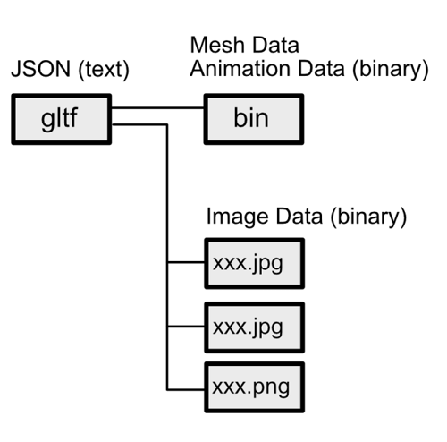

glTF(GL Transmission Format)とは、3Dコンテンツ(3D形状データ)のフォーマットです。    
比較的コンパクトなサイズに収まり、仕様としてシンプルなフォーマットです。    
ネット経由の送受信に向いています。    
3DCGツール(DCCツール)/UnityやUnreal Engineなどのゲームエンジン側から見ると、1つの形状ファイルになります。    

2018年段階は「glTF Version 2.0」が使用されます。    
バージョン違いによる互換性はありません。    

# glTFの仕様について

Khronos Groupが仕様を公開しています。    

https://github.com/KhronosGroup/glTF/blob/master/specification/2.0/

glTFのライブラリやインポータ/エクスポータ、ビュワーなど、個々のプロジェクトはこの仕様書の通りに実装されることになります。    
このライブラリを使用するとglTFのインポータやエクスポータが実装できるというものではなく、    
各自が仕様に乗っ取ってライブラリやインポータ/エクスポータ、ビュワーなどを実装し提供しています。    
Khronos Groupでも公開しているライブラリはありますが、他のプロジェクトと同列な感じがしています（100%安定が期待できるというわけではない）。    
プロジェクトによっては仕様通りに動作しない/
まだ実装していない機能がある、というのも多いです。    

glTFが非営利のオープンフォーマットのためか、glTF関連で提供されているプロジェクトはオープンソースのものが多いようです。    
# glTFを扱えるツールやライブラリ

以下に一覧されています。    
各種言語で使用できるライブラリ、ビュワー、WebGLエンジン、ツールのインポータ/エクスポータなど。    

https://github.com/KhronosGroup/glTF#gltf-tools

# glTFファイルの形式

glTFはファイルとして
2つの形式があります。    

* 拡張子gltfのファイル + bin(バイナリ)ファイル + 画像ファイル
* 拡張子glbのファイル

中身は全く同じものです。    

## gltfファイル

jsonのテキストファイル形式で、拡張子gltfのファイルです。    
これは、メッシュ情報やシーンのノード構成、テクスチャイメージの参照、バイナリデータへのアクセス情報などを記載します。    
メッシュの頂点/法線/UVなどのデータやアニメーションデータは、バイナリ形式で拡張子binのファイルに分離されます。    
このbinファイルは1つのglTFで1つ存在するということが多いですが、複数を持つこともできます。    
また、画像はpng/jpeg形式で別途ファイルに分離されます。  

## glbファイル

gltfファイルのjsonテキストファイル + binファイル + 画像ファイルを1つにまとめたバイナリ形式のファイルです。    
このglbファイルさえあれば、形状の情報はコンパクトに送受信できることになります。    

    

json部はバイナリに変換されて格納されます。    
それ以外のbinやイメージデータはそのまま格納されます。    
そのため、「gltf + bin + jpg/png」よりも少しだけファイルサイズを小さくすることができます。     

# glTFで表現できる機能

* メッシュ (内部的に三角形に分割して格納)
* マテリアル (PBR準拠)
* テクスチャイメージ (png/jpegのどちらか)
* ノードによるシーン階層構造
* カメラ
* メッシュへのスキン割り当て
* Morph Targets
* キーフレームアニメーション    
ノードの移動/回転/スケールアニメーション    
スキンアニメーション    
Morph Targetsのウエイト指定による変形アニメーション    

モデリングの際にどのようにこれらを生かすのか、ということについては [モデリングの際のチェックポイント](modeling.md) に記載しています。    

## 拡張 (Extension)

glTFの機能に対して、いくつか拡張の仕様が用意されています。    
glTF 2.0では、Dracoによるジオメトリの圧縮やマテリアルの拡張などがあります。    
Khronos Groupで提供されている仕様は以下。    

https://github.com/KhronosGroup/glTF/tree/master/extensions

Khronos Groupでの拡張と、各ベンダーの拡張があります。    
この拡張機能を実装しているプロジェクトもいくつかあります。    
### Draco圧縮

https://github.com/google/draco

ジオメトリを圧縮する機能です。    
Draco自身は別プロジェクトになり、C++/JavaScript/Unity(C#)のライブラリとして提供されています。    
これをglTFで使用するように拡張できます。    
glTFでのDraco実装の仕様は以下になります。    

https://github.com/KhronosGroup/glTF/tree/master/extensions/2.0/Khronos/KHR_draco_mesh_compression

ここでのジオメトリは、メッシュの頂点座標/法線/UV/スキン情報などになります。    
これらは圧縮の対象になります。   
Morph Targetsやアニメーション、テクスチャイメージは圧縮の対象外です。    
3Dモデルは大部分がテクスチャイメージで占められる場合が多いため、その場合はあまりDraco圧縮の効果は得られないようです。    
Draco自身でアニメーション対応を実装しつつあるため、今後は現在圧縮対応されてない部分も徐々にglTFで使用できるようになるかもしれません。

### マテリアルのSpecular-Glossiness

glTF 2.0の標準では「Metallic-Roughness」のマテリアルのPBR指定になります。    
別途「Specular-Glossiness」のPBR表現ができるようになります。    

### マテリアルのunlit

ライティングしないノンフォトリアルなマテリアル表現ができるようになります。    

### テクスチャのオフセット/回転/スケールの指定

テクスチャのUVに対して、オフセット/回転/スケールを与えることができるようになります。    
テクスチャマッピング時のタイリングはこの機能で実装できます。    

